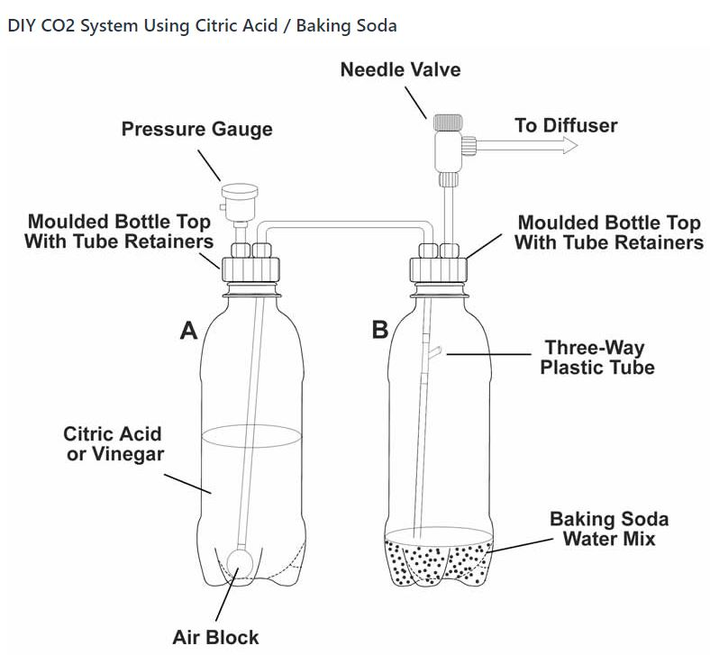
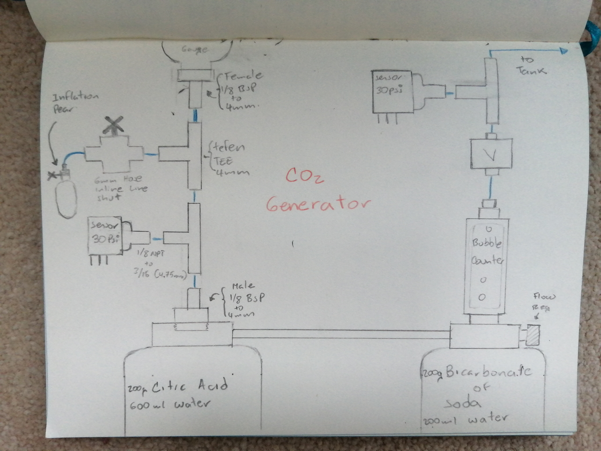
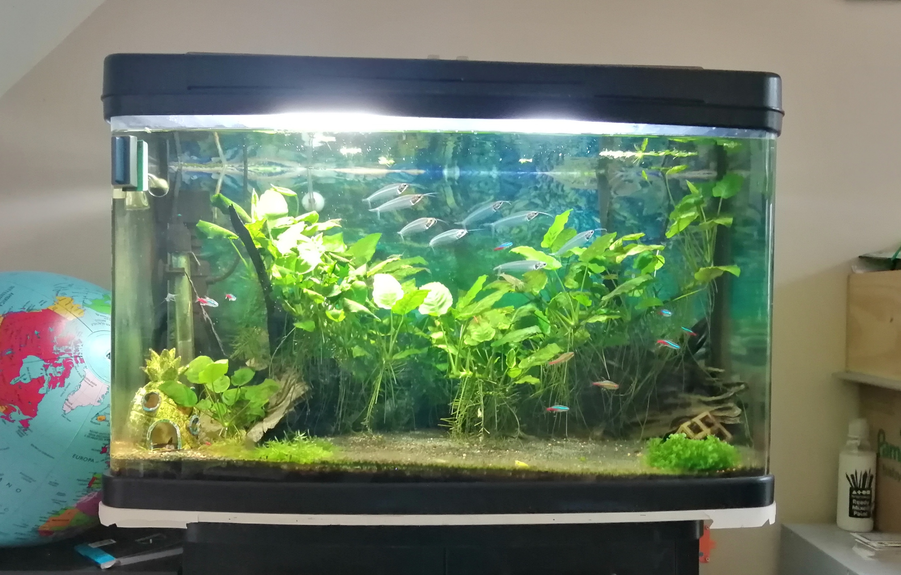

# Description

The success of a planted aquarium depends basically on three factors: Food, light, Clean water and CO2 available. The purpose of this system is to monitor the production and supply of CO2. The CO2 is generated by the reaction between citric acid and bicarbonate of sodium. 

# Basic CO2 Generator system

*To start, citric acid or vinegar is poured into bottle A, and a mixture of baking soda and water is poured in bottle B. The caps with tubing attached are the screwed onto the bottles.
The needle valve is opened, and bottle A is squeezed slightly to inject Citric Acid in to bottle B. This starts the generating of CO2. The needle vale is then closed to allow pressure to build in the bottles.

Mix bottle B by swirling the mixture around - you should see some bubbling. If not, squeeze some more citric acid from bottle A.
When the pressure gauge reads 1.5 bar in bottle A you can slowly open the needle valve to begin the flow of CO2 to your diffuser.*

# How does it work?

*The pressure in the bottles will want to form an equilibrium because they are connected by tubing. So when the pressure is higher in bottle A than in bottle B gas will want to flow from A to B. A consequence of this is that citric acid is injected into bottle B when the pressure in bottle A becomes higher than that in bottle B, which in turn creates more CO2. This additional gas is pushed into bottle A (as well as your diffuser), again making an equilibrium but in reverse to before. When the pressure in B falls below A, citric acid is again pushed from A to B, and so the cycle continues. It's an ingenious system!*

# The Mixture

## Bottle A
200g Citric Acid Powder.
Mix with 600ml Water until dissolved.

## Bottle B
200g Baking Soda
Mix with 200ml Water until dissolved.

# Party Poopers
- Bottle bursting 
--Mitigation: Release valve fitted at 4bar. System fitted inside lockable fish tank cabinet, away from the curious hands of my beloved daughter.

-Too much pressure built up. Might inject/dose too much CO2 putting the fish tank livestock in jeopardy
--System does not have control of the tank supply valve. Fishtank main controller activetes/deactivates the electrovalve to supply C02. The current system is fitted with communication to fish tank's main controller using server/client interface

-Liquids spillage
- Poison the whole house with CO2and die, 
--very unlikely

#Modified CO2 Generator

Once the pressure of the system reaches 1Bar the system is self sustainable and can be left unattended until the citric acid is consumed and the C02 is exhausted. The process of building the pressure up requires a lot of fiddling and stirring the mixture. To overcome this process the following improvements were added:

	1. Pear pressure pump to build pressure faster
	2. Pressure transducers to verify the pressure of the system and the feeding pressure to the tank.
	3. HMI displaying the current pressures of the system
	4. Electro valve that controls the feeding of Co2 to the tank

 

#Hardware

-ESP32 Wroom
-Oled
-Pressure Transducers

#To Do is to Be

- [x] Breadboard prototype
- [x] Pressurise the system
- [ ] ESP32 ADC characterisation curve- Done, not great but good enough see "ESP ADC Characterisation.xlsx"
- [ ] Document  the BOM
- [ ] Assemble vero board
- [ ] Enclosure for the display and the PCB
- [ ] show pressure in bar, PSI, KPa using jumpers
- [ ] Implement the server/client to access pressures from fish tank main controller
- [ ] Install and hook up the tank

#Fish tank

#Links
https://www.co2supermarket.co.uk/diy-co2-kit-setup-instructions-guide-6.html

#Pics
